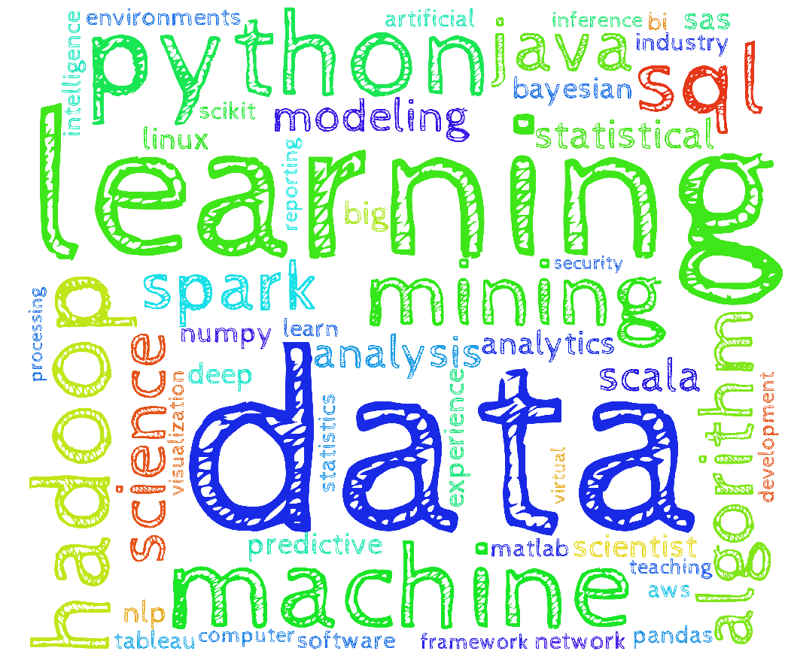

<h1> 
 Job Posting Analyis :Data Scientist from Cybercoder 

</h1>
<!--  -->

&emsp;&emsp; Nowadays, the data science field is hot, and it is unlikely that this will change in the near future. While a data driven approach is finding its way into all facets of business, companies are fiercely fighting for the best data analytic skills that are available in the market, and salaries for data science roles are going in overdrive. Compare with the commonly popular IT related job position, such as software engineer, most of big companies’ increased focus on acquiring data science talent goes hand in hand with the creation of a whole new set of data science roles and titles.

&emsp;&emsp; <a href="https://www.cybercoders.com/">CyberCoders</a> is one of the innovative employment search website in the state. The version of cybercoder’s website is really clear and formatted. Since their posts have no outside links like other employment search websites, we are easier to get the content of each post to construct a data frame. Also, this website focuses more on the IT related job markets, so it is perfect for us to analyze content. Additionally, this website is well organized and frequently update since we found the most of job are posted within 10 days.

  &emsp;&emsp; The project analyzed the job market of data scientists in term of location, salary, skill sets, experience, degree preference.

